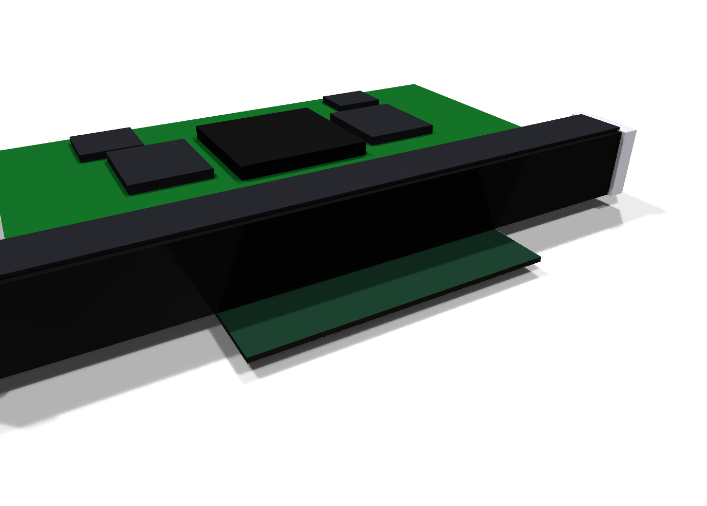
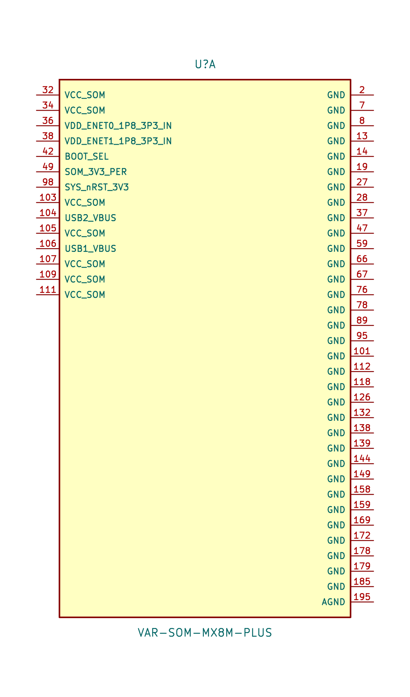
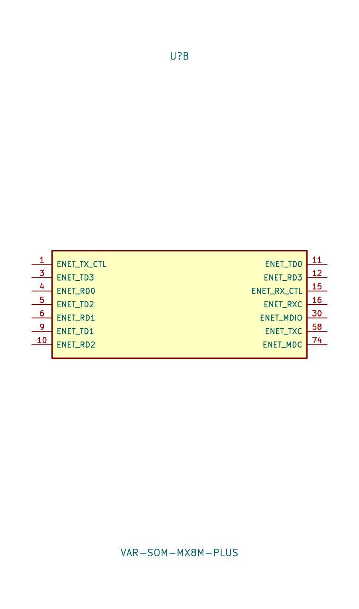
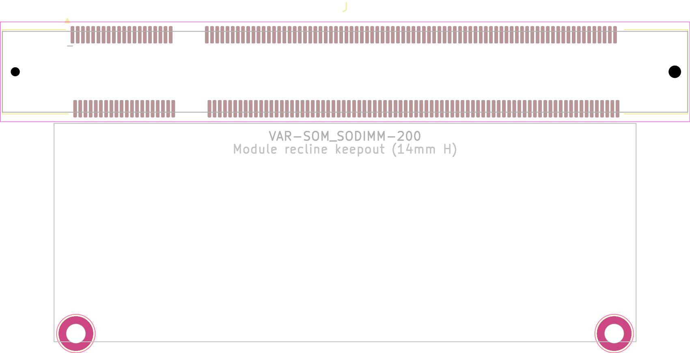

# Variscite VAR-SOM KiCad Library

KiCad 10 library for **Variscite VAR-SOM** Pin2Pin System-on-Module family, which mates
through the standard **200-pin SO-DIMM edge connector** (JEDEC MO-224 Variation AB, 0.6 mm
pitch). Built around the **VAR-SOM-MX8M-PLUS** (NXP i.MX 8M Plus), and reusable for the
pin-compatible siblings (MX8, MX8M-Mini/Nano, MX93, MX6, …).

This library provides all three requested pieces:

| Part | File | Notes |
|------|------|-------|
| **Symbol library** | `VAR-SOM.kicad_sym` | Multi-unit symbols, functional banks |
| **Footprint library** | `VAR-SOM.pretty/VAR-SOM_SODIMM-200.kicad_mod` | 200-pin SO-DIMM socket land pattern |
| **3D model** | `VAR-SOM.3dshapes/VAR-SOM_SODIMM-200.wrl` | Socket + reclined SoM, renders in KiCad 3D viewer |

---

## Contents

### Symbols (`VAR-SOM.kicad_sym`)

Two symbols, each a **multi-unit** part (place only the banks you use):

- **`VAR-SOM-MX8M-PLUS`** – concrete MX8M-Plus part, default-configuration signal names.
- **`VAR-SOM_Pin2Pin_Generic`** – the shared VAR-SOM connector standard; duplicate & rename
  signals for another module in the family.

Both are split into 8 named units:

| Unit | Bank | Unit | Bank |
|------|------|------|------|
| A | Power / System / GND | E | Audio (SAI / SPDIF / codec) |
| B | Ethernet (RGMII) | F | SD / eMMC / NAND |
| C | Display & Camera (LVDS / MIPI-DSI / HDMI / MIPI-CSI) | G | Serial (UART / I²C / SPI / CAN) |
| D | USB & PCIe | H | GPIO / Misc |

Power inputs (`VCC_SOM`, `VDD_ENET*`) and `GND` are on the left/right of unit A; `SOM_3V3_PER`
and `USBx_VBUS` are typed as power **outputs** (rails the module sources).

### Footprint (`VAR-SOM.pretty`)

`VAR-SOM_SODIMM-200` – the carrier-side **200-pin SO-DIMM socket** land pattern:

- 200 SMD pads, 0.6 mm same-row pitch, odd pins (1…199) / even pins (2…200) on the two rows,
  0.3 mm alternating offset, **8.6 mm** row centre-to-centre, pad 0.40 × 2.00 mm.
- DDR2 (1.8 V) key notch between pins 39/41 and 40/42 (11.4 mm + 4.2 mm key + 47.4 mm groups).
- Two socket board-lock holes (Ø1.05 mm left / Ø1.45 mm right, keyed), 14 mm assembly height.
- **Two M2 SoM mounting holes** (`MH1`/`MH2`, plated, GND) at the far edge of the reclined module —
  62.52 mm apart, 30.45 mm from the contact datum, per datasheet Fig. 5. Standoff: MAC8
  **TH-1.6-3.0-M2-B**. (The datasheet text says "four mounting holes" as family boilerplate;
  the MX8M-Plus mechanical drawing shows two.)
- Courtyard, F.Fab body, pin-1 marker, and a `Dwgs.User` "module recline keepout" (67.6 × 25.4 mm).

**Mating sockets:** TE Connectivity **1565917-4**, Concraft **0701A0BE52E**, JST **DM-7D4-H2500**.

### 3D model (`VAR-SOM.3dshapes`)

`VAR-SOM_SODIMM-200.wrl` – an **approximate** VRML model (units = mm, drop-in for KiCad's 3D
viewer): SO-DIMM socket housing + ejector latches + the reclined SoM PCB with SoC / LPDDR4 /
eMMC / PMIC blocks. For a manufacturing-grade model, download Variscite's official STEP from the
[customer portal](https://www.variscite.com/) and point the footprint's 3D model field at it
(or drop it in this folder as `VAR-SOM_SODIMM-200.step`).

---

## Installation

The library uses a KiCad **environment variable** `VARSOM_LIB` so it is portable across projects.

1. **KiCad → Preferences → Configure Paths…** add:
   - Name `VARSOM_LIB`  →  Path `<repo>/Hardware/VAR-SOM based/Library`
2. Add the libraries (either via the GUI, or by copying the provided tables into your project):
   - **Preferences → Manage Symbol Libraries…** → add `${VARSOM_LIB}/VAR-SOM.kicad_sym`
   - **Preferences → Manage Footprint Libraries…** → add `${VARSOM_LIB}/VAR-SOM.pretty`

   Ready-made table entries are in this folder (`sym-lib-table`, `fp-lib-table`); copy their
   `(lib …)` line into your project's or global tables if you prefer editing files directly.

The symbols already reference the footprint (`VAR-SOM:VAR-SOM_SODIMM-200`) and the footprint
references the 3D model via `${VARSOM_LIB}`, so once the path variable is set everything resolves.

---

## Pinout reference

Full 200-pin table (default config + pin-mux alternates) is in
[`doc/VAR-SOM-MX8M-PLUS_pinmap.md`](doc/VAR-SOM-MX8M-PLUS_pinmap.md).

Signal names are the **default module configuration** (no EC / AC / QSPI / SDEX assembly options).
Where a pin has assembly-dependent alternates (e.g. pin 1 `ENET_TX_CTL` vs `NC` with "EC",
pins 146–157 HDMI vs MIPI-CSI2, 160–170 LVDS vs MIPI-DSI), the alternates are listed in the
pinmap; consult the datasheet pin-mux table before finalizing.

---

## Data sources & provenance

- Pinout: **VAR-SOM-MX8M-PLUS V2.x Datasheet, Rev. 1.05** (Table 2 "J1 Pinout"),
  <https://www.variscite.com/wp-content/uploads/2024/05/VAR-SOM-MX8M-PLUS_V2_Datasheet.pdf>
- Connector standard: Variscite VAR-SOM Pin2Pin (200-pin SO-DIMM), JEDEC **MO-224 Var. AB**.
- Socket land pattern: JST **DM-200P** PC-board layout guideline (the reference cited by KiCad's
  own `SODIMM-200_1.8V_Card_edge`), cross-checked against that footprint's pin geometry.

## ⚠️ Verify before fabrication

This library was generated from published datasheets and the JEDEC/JST standard land pattern.
Before committing to a fabrication run, **verify** against the exact datasheet revision and the
chosen socket's customer drawing — in particular the **board-lock hole positions** and the
**module keepout**, which vary slightly between socket vendors. Not affiliated with or endorsed
by Variscite; all trademarks belong to their owners.

## Adding another family module

1. In the symbol editor, duplicate `VAR-SOM_Pin2Pin_Generic`, rename to e.g. `VAR-SOM-MX93`.
2. Rename only the pins that differ per that module's datasheet (the connector, footprint and
   3D model are shared across the whole Pin2Pin family).
